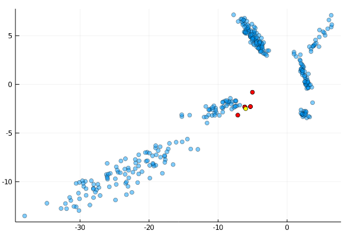

# MPLSH
Multi-probe LSH implementation in julia.

See the following for details:
Lv, Qin, et al. "Multi-probe LSH: efficient indexing for high-dimensional similarity search." Proceedings of the 33rd international conference on Very large data bases. VLDB Endowment, 2007.

